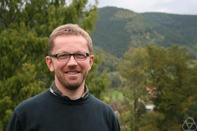

### Prof. István Heckenberger

István Heckenberger is a distinguished German mathematician specializing in Hopf algebras, Nichols algebras, quantum groups, and related algebraic structures. He is currently a Full Professor at the Philipps University of Marburg in Germany. Heckenberger has made seminal contributions to several areas of modern algebra, particularly on Nichols algebras. He coauthored the comprehensive book *Hopf Algebras and Root Systems* with Hans-Jürgen Schneider. 

### Inaugural lecture

TBA

### Weyl groupoids 

#### Preliminares 

TBA 

#### Lectures

TBA 

#### Poster 

Click [here](poster.pdf).

#### When and where? 

|   Lecture   |    Time      |
|:-----------:|:------------:|
|      1      |    TBA       |
|      2      |    TBA       |
|      3      |    TBA       |
|      4      |    TBA       |
|      5      |    TBA       |
|      6      |    TBA       |
|      7      |    TBA       |
|      8      |    TBA       |

### Organizer:

* [Leandro Vendramin](https://www.leandrovendramin.org/)

---
Heckenberger's picture is taken from the Archives of the Mathematisches Forschungsinstitut Oberwolfach.

